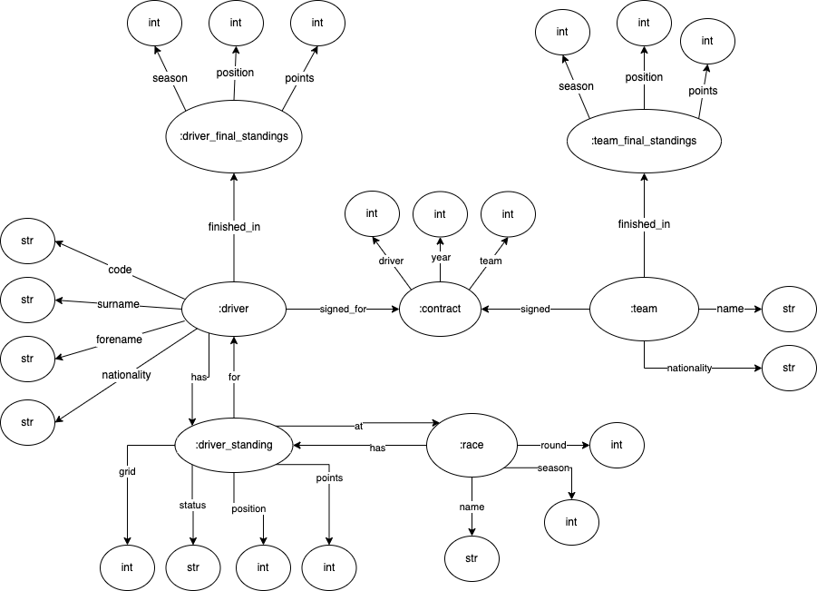

# WS Second Project

The objective of this project was to continue the work made on the previous project [formula1-rdf-info-system](https://github.com/eduardosantoshf/formula1-rdf-info-system), complementing it with new functionalities.

## Course
This project was developed under the [Web Semantic](https://www.ua.pt/en/uc/6496) course of [University of Aveiro](https://www.ua.pt/).

## Technologies

The following libraries were used in the development of the project:
* Django
* Triplestore GraphDB
* RDF (N3)
* RDFS and OWL (Ontologies)
* SPIN (Inferencies)
* SPARQLwrapper

## DB Diagram

    

## How to Run

1. Install the requirements on the `/f1_app` directory:
     
     python3 -m pip install -r requirements.txt

2. Initialize *GraphDB*, create a new repository "db" and import the `f1.nt` and `ontology.n3` files present in the `datasets` directory.

3. Inside the `/f1_app` directory, execute the following command:

    python3 manage.py migrate

4. Finally, to start the app, run the following command, also inside the `/f1_app` directory:

    python3 manage.py runserver

5. To create an admin user, run the following command: `python3 manage.py createsuperuser`

### Inferencies

To have a fully functional system, it is necessary to make the inferencies. After the admin is created, login as admin, go to its page and click on the inferences button.

## Grade 
This project's grade was **16** out of 20.

## Authors
* **Carina Neves**: [carinaneves15](https://github.com/carinaneves15)
* **Eduardo Santos**: [eduardosantoshf](https://github.com/eduardosantoshf)
* **Pedro Bastos**: [bastos-01](https://github.com/bastos-01)
